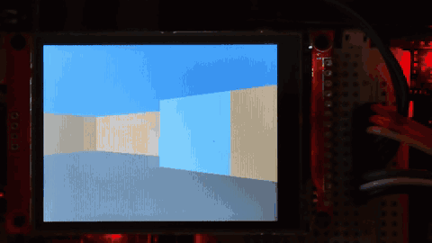
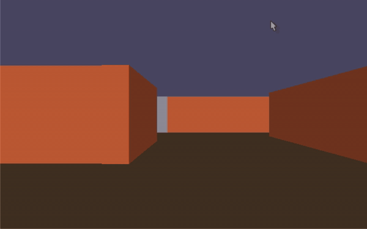
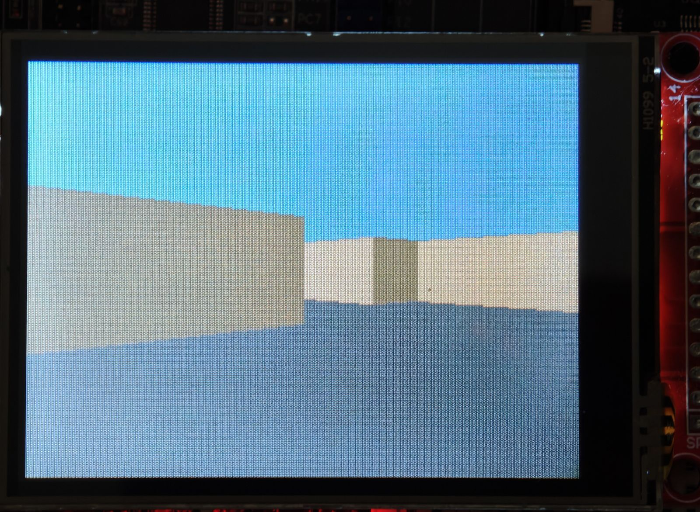
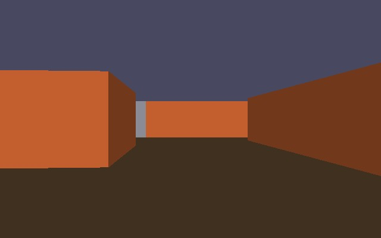
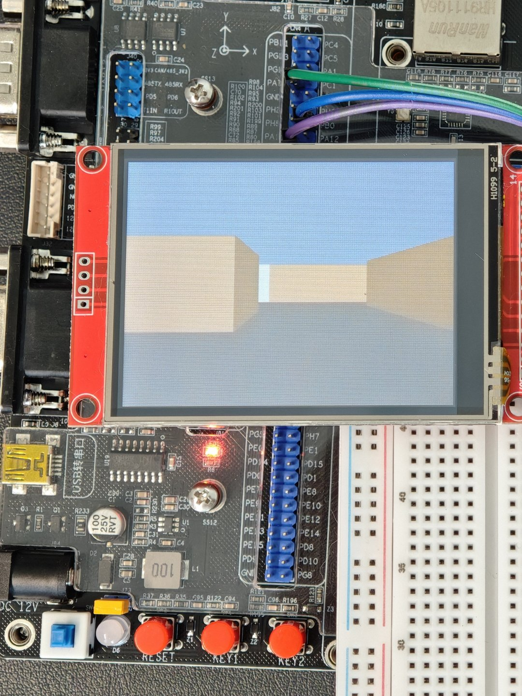

# Raycaster Demo — STM32H743 裸机实时 2.5D 渲染

> Wolf3D 式 2.5D 光线投射（逐列 DDA）在 STM32H743 上的裸机实现。渲染核心与 PC 端（SDL2）共用同一份零依赖 C++17 代码
> 显示链路为自研 [lcdriv](https://github.com/yun-qilong/lcdriv) 驱动 + SPI1 40MHz + DMA 双缓冲。320×240 横屏实测 **29.9fps**，瓶颈是 SPI 带宽本身。
> 当前为裸机大循环，尚未接入 RTOS。

[](https://github.com/yun-qilong/raycaster-demo/actions/workflows/ci.yml)
[](LICENSE)


## 演示

**实机**（STM32H743 + 2.8" SPI 屏，320×240 横屏）：

<p align="center">
  
</p>

**PC 端**（SDL2，640×400，与实机同一份渲染核心）：

<p align="center">
  
</p>

<p align="center">
  
  
</p>

> GIF 为 12fps 采样，不代表实时帧率；实机实测 29.9fps 见[性能实测](#性能实测)。

## 功能

- **实时 2.5D 光线投射**：逐列发射射线 → DDA 求墙距 → 垂直距离校正（去鱼眼）→ 墙条带 + 天地背景。
- **移动与碰撞**：分轴碰撞判定（不可穿墙，贴墙时可沿墙滑动），转向同时支持按键与指针输入。
- **固定时间步长**：逻辑按 16ms（60Hz）步长推进、带累加器上限保护，渲染与逻辑解耦。
- **双端同一核心**：PC 端 SDL2 窗口（640×400，WASD + ←/→ + 鼠标），MCU 端裸机（板载双按键）。
- **核心平台无关**：无平台宏、无堆；分辨率由平台后端传入，两端口径不同但共用同一份代码。

## 硬件

| 项 | 值 |
|---|---|
| MCU | STM32H743IIT6（Cortex-M7 @ 480MHz），野火 Challenger 核心板 |
| 屏幕 | 2.8" 240×320 SPI（ILI9341 兼容控制器 + 74HC245 缓冲），横屏使用 320×240 |
| 总线 | SPI1 **40MHz**（PLL1Q 80MHz ÷ 2）+ TX DMA，软件 CS |
| 帧缓冲 | 双缓冲 2×153.6KB 置于 AXI SRAM；渲染帧缓冲 225KB 置于 D2 SRAM |
| 操作 | 板载双按键（转向 / 前进） |
| 日志 | USART1，115200 8N1 |

接线：SCK `PA5` / MOSI `PA7` / CS `PA4` / DC `PB0` / RST `PB1`（MISO `PA6` 已分配；显示流程不依赖读屏）。

<p align="center">
  
</p>

## 架构

```
src/
  utils/      CrtpBase 等零项目依赖工具
  core/       渲染与逻辑核心（平台无感、零平台宏）：
              Fixed(16.16) / Trig(查表) / Raycaster(DDA) / Map / Movement / Collision / GameLoop
  platform/
    api/      Platform<Impl> CRTP 接口：getTicks / sampleInput / drawBuffer / screenWidth / screenHeight
    sdl/      PC 后端（SDL2 窗口 / 键鼠 / 时钟）
    mcu/      MCU 后端（RGB565 转换 + lcdriv DMA 双缓冲出帧）
pc/           PC 产品树（CMake + main + gtest）
stm32/        MCU 产品树（CubeMX 工程 + HAL + 链接脚本内存分区；目录名沿用早期点灯工程）
tools/        资产管线（地图 → C 数组）
scripts/      构建与数据生成脚本（mapgen、CI 工具）
```

数据流：固定 16ms 步长推进逻辑（采样输入 → 移动 / 转向，含分轴碰撞判定）→ 逐列射线（DDA）→ 定点数着色 →
帧缓冲 → 平台出帧（PC 走纹理上传，MCU 走 RGB565 转换 + DMA 双缓冲）。

平台差异全部收敛到 CRTP 接口 `Platform<Impl>`（5 个方法），核心在编译期与具体平台绑定。

**约束**：C++17 受限子集——无堆 / 无异常 / 无 RTTI / 无虚函数 / 无浮点 / 固定数组。由产品 target 的
`-fno-exceptions -fno-rtti -fno-threadsafe-statics` 与 PC 侧的 `new/delete` 链接门禁（`pc/NoHeap.cpp`）实际看住。

## 关键实现

### DMA 与双缓冲

单缓冲下 DMA 读取缓冲的 30.7ms 内 CPU 不能写入同一块（否则撕裂），只能 `compose → push → 等待 → 再 compose`，
传输与渲染串行，只有 ~21.4fps。改为双缓冲后 compose 与 DMA 并行，传输侧可达 **32.3fps**（≈带宽上限）；
游戏侧实测 29.9fps，差距来自节拍量化。

`pushFrame` 采用 latest-wins：DMA 忙时返回 false，调用方**不切换缓冲**、丢弃本帧继续渲染下一帧，
因此渲染永不被传输阻塞，代价是丢弃部分渲染结果（见"帧节拍量化"）。

写入慢于面板扫描（30.7ms vs 14.3ms），横屏下撕裂边界呈**斜线**——由写入方向与扫描方向垂直导致，属几何必然。

### 缓冲放置与内存分区

两块 153.6KB 帧缓冲（≈300KB）放 AXI SRAM（512KB 区，占 58.6%），渲染帧缓冲 225KB 放 D2 SRAM（288KB 区，占 78.1%），
栈与热数据在 DTCM。选择依据是 **DMA 可达域**与容量：AXI SRAM 在 DMA 主控可达范围内且容量足够放下双缓冲。
具体分区见 `stm32/led_blink/STM32H743xx_FLASH.ld`，占用可在构建产物 `led_blink.map` 中复核。

### 帧节拍量化

推送成功间隔 ≈ ⌈30.7 / T_render⌉ × T_render：T=11.1ms 时 k=3 → ≈33.4ms → **29.9fps**。渲染侧实际跑到 ≈90 帧/s，
即每推送 1 帧要渲染约 3 帧、2/3 被丢弃。这是当前 CPU 的主要浪费，也是下一步"帧率自适应"要解决的问题。

### 32B 代码对齐

`-falign-functions=32 -falign-loops=32`（`stm32/led_blink/CMakeLists.txt`）把函数入口与循环头对齐到
Cortex-M7 取指/Flash 访问的 32 字节粒度。对齐前，改动**无关**代码会移位热点循环、改变取指对齐，
使同一静态场景帧率摆动 ~10%（实测 282 vs 311 帧/5s）；对齐后该抖动消失，渲染单轮 17.7 → 11.1ms。

## 性能实测

| 构建 | 渲染单轮 | 屏更新率 |
|---|---|---|
| `-O0` | 51ms | 19.6fps |
| `-O2` | 17.7ms | 27.6fps |
| `-O2` + 32B 对齐 | **11.1ms** | **29.9fps** |

- **帧预算（硬边界）**：全屏 320×240×2B = 153,600B，`帧时间 = 153600 × 8 ÷ SCK`。40MHz → **30.7ms/帧（≈32.5fps 上限）**。
- **纯传输侧**（`lcd_test`，无渲染负载）：32.3fps，达成率 ≈100%，确认 SPI 带宽是唯一瓶颈。
- **资源占用**：FLASH 32.5KB / 2MB；AXI SRAM 300KB / 512KB（58.6%）；D2 SRAM 225KB / 288KB（78.1%）；DTCMRAM 9.7KB / 128KB。
- **复现方式**：烧录 Release 固件，接串口（115200 8N1）。固件每 5 秒打印 `rendered=` / `pushed=` 增量，
  `pushed ÷ 5` 即屏更新率，`rendered ÷ 5` 即渲染能力（心跳回调见 `stm32/led_blink/Core/Src/game_main.cpp`）。

## SPI 40MHz 的随机故障：根因是线材

最小可用目标（~30fps）要求 SPI 跑到 40MHz——帧预算 30.7ms/帧，没有降频换稳定的余量。但这个频率下固件会随机出错：
大面积写入丢数据、清屏首块异常、显示状态被破坏，且**同一份代码时而正常、时而全坏**，与改了什么无关。

从屏幕控制器角度做过的多项假设（读屏 ID 不可靠、初始化配置组缺失、NSSP 脉冲模式、首笔时序）都解释不了残留现象：
改动后的表现始终不稳定，"改了就变好"无法排除偶发巧合。真正的原因在线材——40MHz 对应 25ns/bit，
20cm 杜邦线在该边沿速率下已到信号完整性边缘。换成 10cm 28 芯线后，**同一份固件立即稳定**
（连续 9 分钟以上 / 17000+ 帧无漂移 / 32.3fps），历史偶发错误同批消失。

完整过程（现象、各项假设与处置、对照实验、结论）：**[docs/bringup.md](docs/bringup.md)**。

## 已知问题

- 无 RTOS：当前是裸机大循环；渲染节拍未与 DMA 对齐，29.9fps 未喂满 32.5fps 上限，且约 2/3 渲染被丢弃。
- 画面撕裂：单帧写入（30.7ms）慢于面板扫描（14.3ms），横屏下撕裂边界呈斜线（几何必然，局部刷新可解）。
- 墙体为纯色条带，贴图未接入；单元测试目前只覆盖定点数模块。
- 缓存未开启，上述性能数据均在该状态下测得。
- SPI 上限未复测：换线后未重做频率爬坡，当前 40MHz 是满足需求的工作点而非面板上限。

## 路线图

按优先级排列：

1. **FreeRTOS 移植**：任务划分（渲染 / 传输 / 输入）与优先级，DMA 完成中断 + 队列/信号量替代大循环轮询。
2. **帧率自适应**：渲染节拍对齐推送，省掉被丢弃的渲染，29.9 → 逼近 32.5fps。
3. **墙体贴图**：纹理采样接入渲染管线。
4. **SPI 频率爬坡重测**：换线后重做爬坡，确定当前接线下的真实上限。
5. **开启 I-Cache**：优化取指路径（本工程对取指对齐敏感，见"32B 代码对齐"）。

其它小项：FPS / 帧耗时叠加显示；局部刷新（变化矩形并集）与全刷混合；更多按键映射与关卡。

单元测试随上述开发同步补充（当前覆盖定点数模块）。

## 构建与运行

### PC（Linux + SDL2）

```bash
sudo apt install -y build-essential cmake ninja-build python3 libsdl2-dev
cmake -S pc -B build -DCMAKE_BUILD_TYPE=Release -DRAYCASTER_BUILD_TESTS=ON
cmake --build build --target raycaster -j "$(nproc)"
./build/raycaster                       # WASD 移动、←/→ 或鼠标转向，Esc 退出
```

### MCU（STM32H743）

```bash
cmake -S stm32/led_blink --preset Release
cmake --build stm32/led_blink/build/Release -j "$(nproc)"
# 产物：led_blink.elf / led_blink.hex（每次构建由 objcopy 重新生成，供 Keil 下载）+ led_blink.map 内存报告
# 烧录：CMSIS-DAP（Keil MDK / OpenOCD 均可）
```

交叉编译需要 `arm-none-eabi-gcc` + CMake + Ninja + `python3`（构建时由 `scripts/mapgen.py` 生成地图头文件
`src/generated/MapData.hpp`，该生成物不入库）。外设与时钟配置由 STM32CubeMX（`stm32/led_blink/led_blink.ioc`）
管理，一律 GUI 生成，不手改生成代码。

### 单元测试

```bash
cmake --build build --target raycaster_ut -j "$(nproc)"
ctest --test-dir build -L raycaster
```

## 开发

- **CI（GitHub Actions，push main 触发）**：构建 / 单元测试 / clang-format / clang-tidy 四道阻断门禁，
  外加提交与 Issue 关联检查（`scripts/check-issue-ref.sh`，提醒式、不阻断），见 `.github/workflows/ci.yml`。
- **提交规范**：`[FTxxxx] 描述 (#issue)`，每条提交关联 Issue。
- **代码规范**：`.clang-format` / `.clang-tidy`，与 CI 使用同一套版本行为。
- **资产零运行时加载**：地图以编译期常量数组进固件（`scripts/mapgen.py` 在构建时生成），见 [tools/README.md](tools/README.md)。

## 相关项目

- [lcdriv](https://github.com/yun-qilong/lcdriv) —— 本项目使用的裸机 SPI LCD 驱动库（Bus × Controller 正交、编译期绑定、带单测与 ADR 文档），固定在其 `26R1.0` 冻结标签上。

## License

[MIT](LICENSE)
